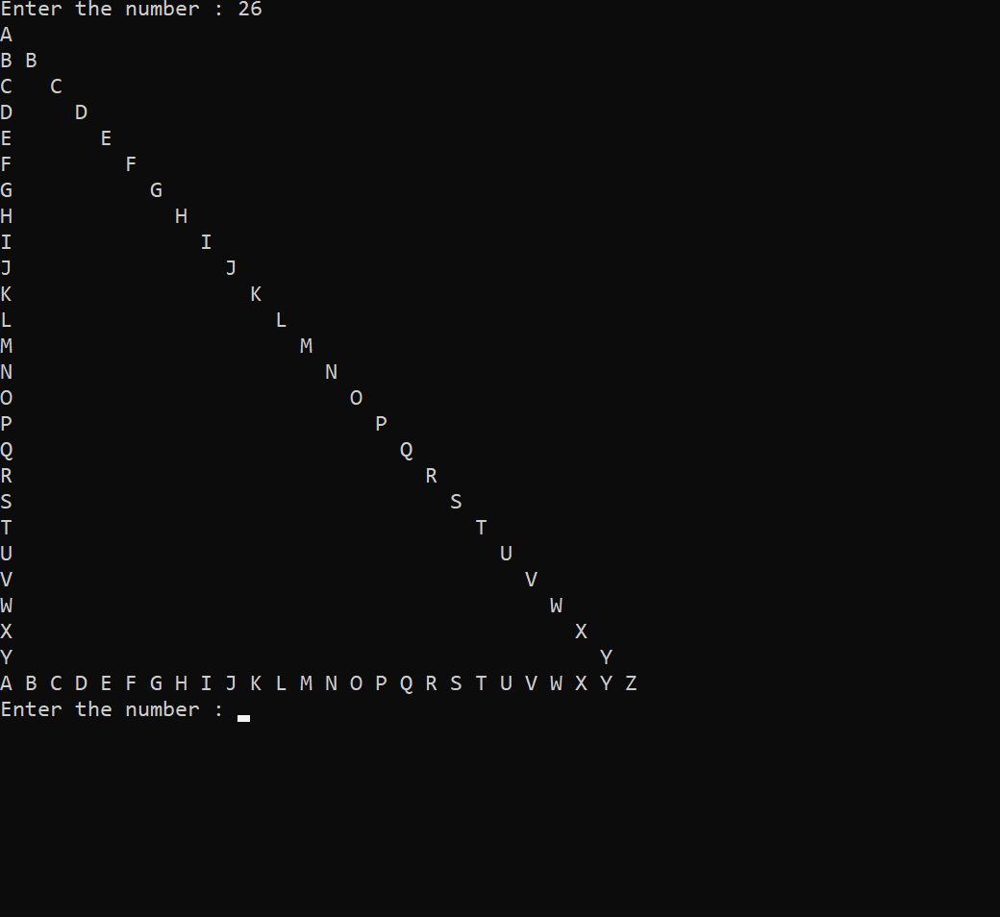

<!--comments-->
_tr_ i~~a~~ `ngle` ~~Ha~~_lf_
---

- [x] star
- [x] alphabet
- [x] small alphabet
- [x] numaric 

<p>// write a programme that print triangle left half</p>  

```c
#include<stdio.h>
int main()
{
    while(1)
    {
        int num,row,col;
        printf("Enter the number : ");
        scanf("%d",&num);

        for(row=1; row<=num; row++)
        {
            for(col=1; col<=row; col++)
            {
                if(row==1 || row==num || col==1 || col==row)
                {
                    printf("* ");
                }
                else
                    printf("  ");
            }
            printf("\n");
        }
    }
}
```  
<image src="./images/lefthalf.png" width="500" title="lefthalf"/>

// write a programme that print alphabet

### pattern with large alphabet

```c
#include<stdio.h>
int main()
{
    while(1)
    {
        int num,row,col;
        printf("Enter the number : ");
        scanf("%d",&num);

        for(row=1; row<=num; row++)
        {
            for(col=1; col<=row; col++)
            {
                if(row==num || col==row)
                    printf("%c ",col+64);
                else if(row==1 || col==1)
                    printf("%c ",row+64);
                else
                    printf("  ");
            }
            printf("\n");
        }
    }
}
```
</br>

### small alphabet

// write a programme that print left half triangle with small alphabet.</br>

just change code from large alphabet.

`printf("%c ",col+64);` To `printf("%c ",col+96);`</br>
`printf("%c ",row+64);` To `printf("%c ",row+96);`</br>

<image src="./images/small.png" width="500" title="small"/>  


continue edit...

